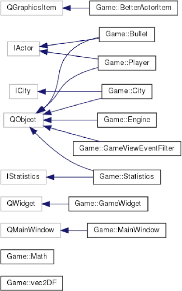

# Ohjelmointi 3 Hajoitustyö, ryhmä ´609uu´

Tämä on ohjelmointi 3-kurssin harjoitustyö, jossa teknologioina käytettiin C++:aa ja Qt:ta.
Projektin ovat toteuttaneet [TeeKups](https://githib.com/TeeKups) ja [j2245](https://github.com/j2245).

## Yleiskuvaus

Toteutimme harjoitustyössä pelin, jossa pelaaja syntyy Tampereen keskustaan, missä hänellä on hetki aikaa yrittää ampua
mahdollisimman monta linja-autoa ja matkustajaa. Pelistä oli ideana lähteä tekemään jonkinlaista bullet-hell tyyppistä
yksinpeliä, mutta rajallisten resurssien vuoksi ihan niin pitkälle ei päästy.  Lopputuotetta voisi luonnehtia aikaiseksi
kehitysvaiheeksi, missä on toteutettuna vasta pistelaskuri, pelaajan liike ja ampuminen. Periaatteessa peli vaatisi enää
jonkinlaisen vihollisen toteuttamista, minkä jälkeen voisi jo sanoa yhden tason olevan toteutettuna. Vihollisia voisi
toteuttaa erilaisina IActor:sta periytettyinä Actoreina. Voisi olla järkevää tehdä myös jonkinlainen BaseEnemy
-tyyppinen ratkaisu, josta voitaisiin luoda helpommin uusia vihollisia, joita voidaan käsitellä logiikassa keskenään
samalla tavalla.

Pelin käynnistyessä avautuu ensin aloitusdialogi. Tässä voi asettaa pelaajalle nopeuden sekä pelille aikarajan. Näitä
kenttiä voitaisiin käyttää esimerkiksi siihen, että haetaan sopivia arvoja pelin lopulliselle versiolle. Aloitusdialogi
on määritelty MainWindow -luokassa.

Kun aloitusdialogissa painetaan aloitusnappia, varsinainen pelinäkymä eli GameWidget asetetaan näkyviin ikkunaan.
Samalla MainWindow emittoi signalin, mistä Engine tietää käynnistää pelilogiikan. Engine käynnistää QTimerin, jonka
jokaisella timeoutilla Kaupungin tila etenee yhdellä "askeleella". Tämän lisäksi Engine kutsuu ```Logic::finalizeGameStart```
funktiota käynnistäen CourseLib:n logiikan, joka käsittelee linja-autoja ja matkustajia.

Engine kuuntelee erinäisiä signaleja, joiden kautta pelin eri palikat pystyvät kommunikoimaan keskenään. Engine toimii
pelimoottorin tapaan eräänlaisena keskusyksikkönä, minkä kautta kaikki kommunikointi tapahtuu. Näin pystytään välttymään
suunnattomilta osoitinviidakoilta ja samalla ohjelman laajennettavuus paranee. Engineen pystytään periaatteessa
kytkemään ihan mitä tahansa olioita kiinni ja määrittelemään Enginessä olioiden interaktiot. Esimerkiksi tilastoja
kerätään Statistics oliolla, jonka funktioita kutsutaan Enginessä.

Kun edellä mainittu QTimer on ollut käynnissä aloitusdialogissa määritellyn ajan, Engine pysäyttää pelilogiikan ja
informoi siitä MainWindowia. Tällöin MainWindow vaihtaa näkyviin lopetusikkunan, missä näytetään kyseisen pelikerran
tilastot. Pisteitä pelaaja saa siitä, paljonko nyssejä ja matkustajia se saa tuhottua. Tämän lisäksi näytetään
osumatarkkuus ym. nice-to-know tietoja.

## Dokumentaatio

Tässä dokumentissa esitellään yleistason kuvaus ohjelman tärkeimmistä luokista, niiden vastuunjaosta ja ohjelman
kokonaisarkkitehtuurista. Tarkempi kuvaus, mukaanlukien esimerkiksi rajapinnat, sopimussuunnittelut yms., on
kommentoituna ohjelman header-tiedostoihin. Doxygen-ohjelmalla voi generoida niistä automaattisesti siistin
dokumentaation. Documentation-kansiosta löytyy kaksi tiedostoa: ```Doxyfile-Nysse``` ja ```Doxyfile-Game```. Ensiksi mainittu luo
dokumentaation koko projektista mukaan lukien CourseLib. Jälkimmäinen luo dokumentaation vain projektin itse
toteutetuista osista, eli Game-aliprojektista. Dokumentaatiot gneroidaan ```./doxyfiles/nysse/out``` ja ```./doxyfiles/game/out```
-hakemistoihin.

Yksikkötestejä ei ole liiemmin dokumentoitu, sillä ne ovat erittäin yksinkertaisia, mikä johtuu siitä että Statistics
luokkakin jäi melko yksinkertaiseksi. Muille luokille yksikkötestejä ei ehditty, mutta esimerkiksi Math -luokalla olisi
hyvä varmistaa laskuoperaatioiden toimivuus.

## Ohjelman rakenne ja toteutus
Ohjelmassa on neljä pääkomponenttia: Engine, Statistics, MainWindow ja City. Lisäksi pelissä on muutamia muita luokkia,
joita edellä mainitut hyödyntävät. Tässä luvussa tarkastellaan niiden vastuita ja toteutusta. Olioiden väliset
periytymissuhteet on esitetty seuraavassa luokkakaaviossa.



### Engine
Engine on QObjectista periytetty luokka. Periytys on tehty signalien ja slottien käyttämisen vuoksi. Olion on oltava
QObject, jotta sillä on kyseiset ominaisuudet käytössä.

Enginen luominen palauttaa käynnistämistä odottavan Engine-olion. Enginellä on jäsenmuuttujinaan käytössä pointterit
MainWindow, City, Logic ja Player -tyyppisiin olioihin. Kun engine käynnistetään sen ```start()``` -funktiolla, MainWindow
asetetaan näkyviin, Citylle asetetaan tausta, Logicille annetaan kohteeksi City, ja yhdistetään useita signaleja ja
slotteja edellä mainittujen olioiden kommunikoinnin mahdollistamiseksi.

Käynnistämisen jälkeen egnine jää odottamaan MainWindow:n ```startBtnClicked``` -signalia. Kyseisen signalin saatuaan, se
lisää Playerin kaupunkiin, käynnistää pelilogiikan ja käynnistää muutamia ajastimia. Ajastimien timeooutit on kytketty
Cityn advance-slottiin, tilastojen päivitykseen ja pelikelloon. Pelikellon laskiessa nollaan (teknisesti ottaen
ykköseen, koska se käy ikään kuin yhden sekunnin jäljessä) peli pysähtyy ja kutsutaan ```stopGame()``` funktiota. Tällöin
MainWindowiin asetetaan lopetusnäkymä näkyviin, minkä lisäksi logiikka sekä ajastimet pysäytetään ja Citylle kerrotaan
pelin päättymisestä.

Engine on niin sanotusti kaikkitietävä. Kaikki data olioiden välillä kulkee sen kautta. Tämä mahdollistaa helpon
laajennettavuuden ja estää mahdottoman osoitinviidakon syntymisen. Enginen pääasiallinen tehtävä on hallita ohjelman
kulkua ja olioiden välistä kommunikointia.

### City
City kuvaa pelissä olevaa kaupunkia. Sille on määriteltynä jokin pelialue, missä pelaaja ja luodit voivat liikkua.
Lisäksi sen sisällä on suuri määrä matkustajia ja linja-autoja, joista kaikki eivät ole pelialueella. Tämä on
suunniteltua, sillä muutoin pelialueelle ei voisi sen ulkopuolelta tulla linja-autoja tai niiden mukana matkustajia

Luomisen jälkeen City on pysähtyneessä tilassa, eli ```gameRunning == false```. Citylle voidaan luomisen yhteydessä antaa
pelialueen rajat, tai sitten se voi päätellä ne taustakuvan koosta, minkä perusteella rajat joka tapauksessa
määräytyvät ellei toisin määritelty. Cityllä on headerissa määritelty oletustaustakuva, mutta sille voidaan
setBackground -funktion avulla määritellä uusi taustakuva. Kyseinen funktio ottaa parametrikseen ison ja pienen kuvan,
mutta vain iso huomioidaan tässä toteutuksessa. City muistaa sille asetetun taustakuvan, mutta se vain määrittelee
rajansa sen mukaan. Sama kuva tulee Enginessä asettaa MainWindow:n taustaksi.

Cityn tehtävä on pitää kirjaa sen sisälllä olevista Actoreista ja havainnoida niiden välisiä interaktioita. Cityllä on
luonnollisesti metodit Actorien lisäämistä ja poistamista varten. Lisäksi sillä on ```advance()``` -slotti, missä se
tarkastelee Actorien välisiä interaktioita. Tällä hatkellä ainoa määritelty interaktio on, että luodin osuessa
linja-autoon tai matkustajaan, luoti ja sen kohteet häviävät, jolloin emittoidaan kyseisestä tapahtumasta kertova
signaali. Engine kuuntelee näitä signaaleja ja suorittaa niiden implikoimat toiminnot Statistic:lle ja MainWindowlle.

Enginessä luotu Logic -olio kutsuu edetessään Cityn ```actorMoved()``` -metodia, jossa City emittoi ```actorMovedSgn``` -signaalin
actorin tyypistä riippuvilla parametreilla. Engine kuuntelee tätäkin signaalia ja päivittää sen perusteella
MainWindow:ssa BetterActorItemien koordinaatteja.

### MainWindow
MainWindow on vastuussa pelin graafisen käyttöliittymän esittämisestä sekä syötteen vastaanottamisesta ja eteen päin
välittämisestä. Tarkkaan ottaen pelillä on kolme eri QWidget-tyyppistä käyttöliittymää, joiden välillä MainWindow 
vaihtelee. MainWindow:n sisällä ei ole varsinaista pelilogiikkaa ollenkaan, eikä se ota kantaa BetterActorItemien
sijainteihin.

Syötteen keräämisen lisäksi MainWindow:n tärkeimmät ominaisuudet ovat eri käyttöliittymien näyttäminen ja BetterActorItemien liikuttelu sen
sisäisessä GameWidget:ssä. MainWindow:ssa on kolme eri käyttöliittymää: startmenu, gameui ja endscreen. Näistä gameui on
tyyppiä GameWidget ja muut ovat ihan vain QWidgettejä. Startmenu avataan ennen pelin käynnistämistä ja siinä on
toiminnot syötteen keräämiseksi käyttäjältä. Endscreen sen sijaan näytetään pelin päättymisen jälkeen ja se vain näyttää
pelisession tilastot pelin päättymis hetkellä. Kumpikin on toteutettu hyvin yksinkertaisesti ja niitä olisi helppo
laajentaa esimerkiksi samaan tapaan kuin gameui on toteutettu. Gameui in näkyvissä pelin ollessa käynnissä ja on
huomattavasti edellä mainittuja monimutkaisempi.

#### GameWidget
GameWidget on QWidgetistä periytetty BetterActorItemien liikutteluun erikoistunut luokka. Sillä on kiinteästi
määritelty GUI:n ulkonäkö, mutta myöskin kokoelma helppokäyttöisiä metodeja, joilla sen sisällä olevia
BetterActorItemeitä on helppo käsitellä niiden ID:n perusteella. Saman toiminnallisuuden toteuttaminen MainWindow:ssa
vaatisi paljon koodia, mikä ei varsinaisesti liity pääikkunan toiminnallisuuteen. Tämän takia pelin esittämistä varten
alun perin luotiin oma luokkansa.

Edellä mainittujen hyötyjen lisäksi GameWidgetin toteuttaminen omana luokkanaan mahdollistaa useiden GameWidgettien
esittämisen samaan aikaan, mitä voitaisiin käyttää esimerkiksi paikallisessa moninpelissä tai vaikka useiden kaupunkien
esittämiseen samaan aikaan. Nämäkin ominaisuudet vaatisivat järkyttävät määrät copy-paste koodia jos ne oltaisiin
toteutettu suoraan MainWindowissa.

GameWidget kerää myöskin syötettä, mutta vain hiireltä. Se emittoi signaaleja, kun pelinäkymä menettää fokuksen tai kun
sitä klikataan. Näiden perusteella MainWindow välittää Enginelle tietoa kyseisistä tapahtumista, jolloin voidaan
esimerkiksi pysäyttää näppäinten lukeminen tai luoda Bullet. Peli voitaisiin myös asettaa pauselle tämän perusteella,
mutta sitä ei olla toteutettu.

### Statistics
Statistics on hyvin yksinkertainen luokka pelin tapahtumien tilastoimista varten. Se on luotu ns tilastoinnin
perustoteutuksesi ja sitä on tarkoitus laajentaa. Tästä syystä useat sen metodit on määritelty virtuaalisiksi.

Statistics:n funktioita voidaan kutsua suoraan Statistics-olion kautta, ja sen lisäksi sille voidaan välittää
tapahtumaperusteisesti tietoa Bullettien ampumisesta, osumisesta ja actorien tuhoutumisesta.

### Muut luokat
Pelissä on myös muita "vähäpätöisempiä" luokkia, joita muut luokat käyttävät. Esitellään nekin lyhyesti.

#### Player
Player on manuaalisesti ohjattava toimija, joka voi ampua Bulletteja. Pelaajalla on IActorilta perityt metodit, minkä
lisäksi sille on määritelty slotteja ampumista, etenemistä ja luotien osumista varten. Pelaaja huolehtii toistaiseksi
omien luotiensa liikuttamisesta. Tämä toiminta voisi olla järkevää siirtää Cityn alaisuuteen, jos pelissä olisi
useampia toimijoita, jotka kykenevät ampumaan. Nykyinen toiminta johtaa siihen, että jokaisen ampuvan actorin advance()
-slotteja jouduttaisiin kutsumaan jatkuvasti sen sijaan, että kaikki luodit liikkuisivat City::advance():n toimesta.

#### Bullet
Bullet on IActor:sta periytetty luokka, joka osaa liikuttaa itse itseään, tosin slotin kautta. Kun Bullet luodaan, sillä
on jokin nopeus. Kun ```Bullet::move()``` slottia kutsutaan, luoti liikkuu nopeutensa verran. Luodeilla on myös tieto siitä,
kuka ne on ampunut, minkä perusteella voidaan tehdä tulkintoja siitä, kenelle mikäkin luoti on vaarallinen (friendly
fire).

#### BetterActorItem
BetterActorItem on Actorien piirtämiseen tarkoitettu QGraphicsItem:stä periytetty luokka. Kun BetterActorItem:n
keskipiste vastaa sen sijaintia pelissä ja sen muoto määräytyy ItemType:n mukaan.

Kaikki BetterActorItemit ovat toistaiseksi 15x15 pikselin kokoisia (boundingRectanglen mukaan). Tämäkin voisi määräytyä
tyypin mukaan, jolloin hitboxit voitaisiin määritellä paremmin grafiikoita vastaaviksi.

#### vec2DF, Math ja types.hh
Pelissä on mukana myös muutama ns. apuluokka. Vec2DF määrittelee 2-ulotteisen vektorin, jolle pätevät vektorien
yhteenlaskusäännöt sekä vektorin ja skalaarin tulo. ItemType -enumia käytetään pelaajien identifioimiseen ja lisäksi
types.hh:ssa määriteltyä ID:tä ja ```getNextID```:tä käytetään ohjelmassa olioitten ID:iden generoimiseen. Uniikkien ID:iden
määrä on rajallinen, mutta on ajateltu että se riittää varsin hyvin yksittäiseen peliin.

Math -luokassa on määritelty muutamia staattisia funktioita, joilla voidaan laskea 2-ulotteisia yksikkövektoreita ja
2-ulotteisen vektorin euklidinen normi.

## Lisäominaisuudet
Toteutimme seuraavat lisäominaisuudet:
- Tasainen ruudunpäivitys
	- Engine kutsuu kaupungin ja pelaajana ```advance()``` metodia ```Engine::framerateTgt``` -muuttujan mukaisella taajuudella.
	Kyseiset metodit taas johtavat ruudun päivittämiseen, minkä takia ruudun päivitystaajuus on ```Engine::framerateTgt``` (niissä
	määrin kun tietokone jaksaa laskea).

- Vieritettävä kartta
	- Pelaajan liikuttaminen emittoi signaalin, jonka perusteella MainWindow ja GameWidget keskittävät pelinäkymän pelaajan
	sijaintiin. Qt käsittelee tilanteet, missä pelaajan sijaintiin ei voida tarkalleen keskittää näkymää (kun pelaaja on
	kartan kulmassa). City huolehtii siitä, että pelaaja ei pääse poistumaan pelialueelta.

- Pelihahmon tasainen liike
	- ```Engine::kboardHandler``` liikuttaa Pelaajaa jokaisessa pelin askeleessa (```Engine::timer::timeout```) näppäinten määräämään
	suuntaan näppäinpainallusten muodostaman yksikkovektorin ja pelaajan liikenopeuden tulon verran

- Pelin tilan seuranta
	- Statistics pitää reaaliaikaisesti kirjaa tilastoista. ```Engine::statsTimer::timeout``` on kytketty enginen slottiin, joka
	kysyy Statistics:lta tilastoja ja käskee MainWindowia päivittämään niitä vastaavat tekstikentät.

- Oma lisäominaisuus: tuki N käyttöliittymälle MainWindow:ssa + GameWidget
	- MainWindow:ssa on mahdollisuus näyttää montaa erilaista käyttöliittymää avaamatta uusia pop-up ikkunoita tai
	menettämättä näkymien tietoja eri näkymien välillä liikuttaessa. Tämän mahdollistaa ```GameWidget```, joka koodimääränsä
	puolesta mielestämme voidaan laskea lisäominaisuudeksi. Samaan tyyliinhän olisi mahdollista toteuttaa mitä tahansa
	käyttöliittymiä. Käyttöliittymät muistavat oman tilansa, joten eri näkymän esittäminen ei aiheuta tietojen menetystä
	käyttöliittymässä.
	
	- Vastaavan toiminnallisuuden toteuttaminen ilman GameWidgettiä, tai muuta vastaavaa luokkaa, vaatisi tolkuttoman määrän
	toisteista koodia MainWindow:ssa, koska kaikkien käyttöliittymien tilat pitäisi tallettaa erikseen MainWindowiin.
	Oikeanlaisilla tietorakenteella se olisi ehkä tehtävissä, mutta GameWidgetin tyyppisellä toteutuksella lopputulos on
	huomattavasti selkeämpi, helposti hallittavampi, ja sitä kautta laajennettavampi.

## Työnjako
Työnjako toimi mielestämme erittäin hyvin. Kommunikoimme harkkatyötä tehdessä paljon ja autoimmme toisiamme
ongelmanratkaisussa. Gitin committimäärät eivät täysin heijasta tätä, koska työn alkupuolella harrastimme jonkin verran
parikoodausta ja myös committien koko vaikuttaa niiden määrään.

Molemmilla meistä on melko paljon kursseija nyt syksyllä, minkä takia harkkatyö tehtiin vähän kiireellä. Pyrimme
kuitenkin kumpikin tekemään parhaamme, eikä kumpikaan joutunut tekemään ns. leijonanosaa työstä. Jatkossa varmaan
kannattaisi aloittaa harkkatöiden teko vähän aikaisemmin. Toisaalta, pyrimme alunperin aloittamaan miltei heti
tehtävänannon julkaisun jälkeen, mutta alkuperäisen koodipohjan ongelmat hidastivat alkuun pääsyä melko paljon.
